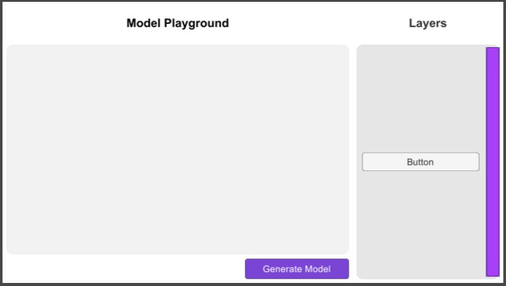

# Đồ án giữa kỳ môn Phát Triển Game - 17TN

## Giới thiệu
- Tên ứng dụng: ML Model Dragging Composer
- Chức năng: trình soạn thảo kiến trúc mô hình học máy dưới dạng kéo thả và xuất tập tin định nghĩa cho framework Pytorch.

## Giao diện

